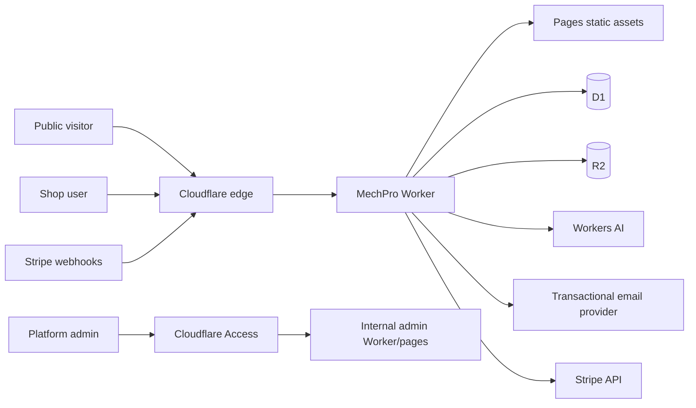
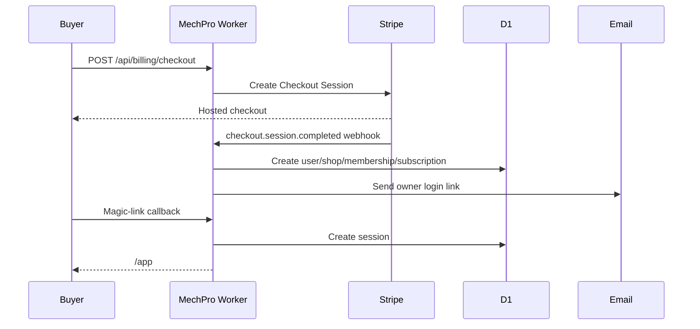

# Cloudflare SaaS Architecture

This is the target architecture for turning MechPro into a public, paid SaaS on
Cloudflare. Cloudflare Access should be reserved for internal operator/admin
surfaces only; customer signup, login, billing, and shop access should be owned
by the app.

## Product surfaces

| Surface | Host/path | Audience | Auth |
|---|---|---|---|
| Marketing site | `https://www.yourcarguy806.com/` | Public buyers | None |
| Pricing/sign-up | `/pricing`, `/signup` | Prospects | Turnstile + Stripe Checkout |
| Customer app | `/app` | Shop owners and staff | App session cookie |
| Public API | `/api/*` | Browser app, webhooks, desktop client | Route-specific |
| Internal admin | `https://admin.yourcarguy806.com/` | Platform operators | Cloudflare Access |

The current production routing keeps Pages on `www.yourcarguy806.com` and the
Worker on `www.yourcarguy806.com/api/*`. Public pages and the app shell are Pages
assets; `/api/*` is handled directly in Workers.



## Cloudflare service map

| Capability | Cloudflare service | Responsibility |
|---|---|---|
| Static site/app shell | Pages | Marketing pages, app bundle, docs, legal pages |
| Request routing/API | Workers | Auth, billing, tenant APIs, webhooks, file proxy |
| Database | D1 | Users, shops, memberships, sessions, billing state, app entities |
| Files | R2 | Inspection photos, signatures, reports, desktop downloads |
| AI assistant | Workers AI | Shop assistant, diagnostics explanation, phone response drafting |
| Bot protection | Turnstile | Signup, login, invite acceptance, contact/demo forms |
| Edge security | WAF/rate limiting | Protect auth, billing, AI, webhooks, uploads |
| Operator SSO | Access | Internal admin only, not customer login |
| Logs/analytics | Workers observability | Request errors, latency, deployment health |

## Runtime routing

Recommended production routing:

```text
GET  /                         -> Pages marketing homepage
GET  /pricing                  -> Pages pricing page
GET  /signup                   -> Pages signup page
GET  /login                    -> Pages login page
GET  /app                      -> Pages authenticated app shell
GET  /app/*                    -> Pages app shell fallback
POST /api/auth/magic-link      -> Worker
GET  /api/auth/callback        -> Worker
POST /api/auth/logout          -> Worker
GET  /api/auth/session         -> Worker
POST /api/billing/checkout     -> Worker
POST /api/billing/webhook      -> Worker, unauthenticated Stripe signature
POST /api/billing/portal       -> Worker
GET  /api/entities/*           -> Worker, customer session required
GET  /api/files/*              -> Worker, customer session required
POST /api/files/*              -> Worker, customer session required
```

The Worker should decide auth by route:

| Route group | Auth model |
|---|---|
| Public pages | None |
| Signup/login | Turnstile + short-lived one-time tokens |
| App APIs | D1-backed session cookie |
| Stripe webhooks | Stripe signature verification |
| AgentPhone/webhooks | Provider HMAC signature verification |
| Internal admin | Cloudflare Access + platform role |

## Customer authentication

Use app-owned auth instead of Cloudflare Access for customers.

Recommended first release:

- Email magic-link login.
- Secure `HttpOnly` session cookie.
- D1-backed sessions with server-side revocation.
- Turnstile challenge on login/signup.
- No passwords in v1.
- Optional passkeys/passwords later.

Core auth tables:

```sql
CREATE TABLE users (
  id TEXT PRIMARY KEY,
  email TEXT NOT NULL UNIQUE COLLATE NOCASE,
  name TEXT,
  email_verified_at TEXT,
  created_at TEXT NOT NULL,
  updated_at TEXT NOT NULL
);

CREATE TABLE shops (
  id TEXT PRIMARY KEY,
  name TEXT NOT NULL,
  slug TEXT NOT NULL UNIQUE,
  timezone TEXT NOT NULL DEFAULT 'America/Chicago',
  billing_status TEXT NOT NULL DEFAULT 'trialing',
  created_at TEXT NOT NULL,
  updated_at TEXT NOT NULL
);

CREATE TABLE shop_memberships (
  shop_id TEXT NOT NULL,
  user_id TEXT NOT NULL,
  role TEXT NOT NULL CHECK (role IN ('owner', 'admin', 'service_writer', 'technician', 'office')),
  status TEXT NOT NULL CHECK (status IN ('active', 'invited', 'disabled')),
  created_at TEXT NOT NULL,
  updated_at TEXT NOT NULL,
  PRIMARY KEY (shop_id, user_id),
  FOREIGN KEY (shop_id) REFERENCES shops(id) ON DELETE CASCADE,
  FOREIGN KEY (user_id) REFERENCES users(id) ON DELETE CASCADE
);

CREATE TABLE sessions (
  id TEXT PRIMARY KEY,
  user_id TEXT NOT NULL,
  token_hash TEXT NOT NULL UNIQUE,
  expires_at TEXT NOT NULL,
  created_at TEXT NOT NULL,
  last_seen_at TEXT,
  revoked_at TEXT,
  FOREIGN KEY (user_id) REFERENCES users(id) ON DELETE CASCADE
);

CREATE TABLE login_tokens (
  id TEXT PRIMARY KEY,
  email TEXT NOT NULL COLLATE NOCASE,
  token_hash TEXT NOT NULL UNIQUE,
  return_to TEXT,
  expires_at TEXT NOT NULL,
  used_at TEXT,
  created_at TEXT NOT NULL
);
```

Session cookie requirements:

```text
Name: mechpro_session
Flags: HttpOnly; Secure; SameSite=Lax; Path=/; Max-Age=<duration>
Stored value: opaque random token
Database value: SHA-256 hash of token, never the raw token
```

## Tenant isolation

Every customer-owned record must be scoped by `shop_id`.

Rules:

1. Resolve `user_id` from the session cookie.
2. Resolve allowed `shop_id` values from `shop_memberships`.
3. Derive the active shop from membership, not from untrusted request data.
4. Include `shop_id` in every D1 query predicate.
5. Use R2 object keys prefixed with `shops/{shop_id}/`.
6. Include audit events for role, billing, file, and destructive actions.

Recommended entity table shape:

```sql
CREATE TABLE entities (
  shop_id TEXT NOT NULL,
  entity_type TEXT NOT NULL,
  entity_id TEXT NOT NULL,
  data_json TEXT NOT NULL CHECK (json_valid(data_json)),
  created_by TEXT NOT NULL,
  created_at TEXT NOT NULL,
  updated_at TEXT NOT NULL,
  deleted_at TEXT,
  PRIMARY KEY (shop_id, entity_type, entity_id),
  FOREIGN KEY (shop_id) REFERENCES shops(id) ON DELETE CASCADE
);

CREATE INDEX idx_entities_list
  ON entities(shop_id, entity_type, updated_at)
  WHERE deleted_at IS NULL;
```

## Billing architecture

Stripe owns payment collection. D1 owns the application entitlement snapshot.



Billing tables:

```sql
CREATE TABLE plans (
  id TEXT PRIMARY KEY,
  stripe_price_id TEXT NOT NULL UNIQUE,
  name TEXT NOT NULL,
  monthly_price_cents INTEGER NOT NULL,
  max_users INTEGER NOT NULL,
  max_locations INTEGER NOT NULL,
  monthly_ai_requests INTEGER NOT NULL,
  diagnostics_enabled INTEGER NOT NULL DEFAULT 0,
  payroll_enabled INTEGER NOT NULL DEFAULT 0,
  active INTEGER NOT NULL DEFAULT 1
);

CREATE TABLE billing_customers (
  shop_id TEXT PRIMARY KEY,
  stripe_customer_id TEXT NOT NULL UNIQUE,
  created_at TEXT NOT NULL,
  FOREIGN KEY (shop_id) REFERENCES shops(id) ON DELETE CASCADE
);

CREATE TABLE subscriptions (
  shop_id TEXT PRIMARY KEY,
  stripe_subscription_id TEXT UNIQUE,
  plan_id TEXT NOT NULL,
  status TEXT NOT NULL,
  current_period_end TEXT,
  cancel_at_period_end INTEGER NOT NULL DEFAULT 0,
  updated_at TEXT NOT NULL,
  FOREIGN KEY (shop_id) REFERENCES shops(id) ON DELETE CASCADE,
  FOREIGN KEY (plan_id) REFERENCES plans(id)
);

CREATE TABLE billing_events (
  id TEXT PRIMARY KEY,
  stripe_event_id TEXT NOT NULL UNIQUE,
  event_type TEXT NOT NULL,
  processed_at TEXT NOT NULL,
  payload_json TEXT NOT NULL CHECK (json_valid(payload_json))
);
```

Initial commercial plans:

| Plan | Price | Limit model |
|---|---:|---|
| Starter | `$49/mo` | 2 users, 1 location, core dispatch/work orders |
| Shop | `$149/mo` | 10 users, scheduling, invoices, inventory |
| Pro | `$299/mo` | 25 users, diagnostics, AI, payroll |
| Enterprise | Custom | Custom limits, onboarding, SSO, priority support |

## Worker boundaries

Keep the first public SaaS implementation as one Worker until scale forces a
split. Organize code by module:

```text
worker/src/
  index.js              Route entry point
  auth.js               Sessions, magic links, Turnstile
  billing.js            Stripe checkout/webhooks/portal
  tenants.js            Shops, memberships, invites
  entities.js           Shop-scoped CRUD/sync
  files.js              R2 upload/download proxy
  ai.js                 Workers AI usage and limits
  admin.js              Internal operator APIs
  security.js           HMAC, hashing, cookies, signatures
  db.js                 D1 helpers and transactions
```

Split into separate Workers later only if needed:

| Worker | When to split |
|---|---|
| `mechpro-web` | If SSR/Pages Functions become complex |
| `mechpro-api` | Default app API |
| `mechpro-webhooks` | If billing/provider traffic needs isolated deploy risk |
| `mechpro-admin` | If operator tooling grows separately |

## Secrets and variables

Worker secrets:

```text
SESSION_SECRET
MAGIC_LINK_SECRET
STRIPE_SECRET_KEY
STRIPE_WEBHOOK_SECRET
TURNSTILE_SECRET_KEY
EMAIL_API_KEY
INTEGRATION_ENCRYPTION_KEY
DIAGNOSTICS_CAPABILITY_SECRET
```

Worker vars:

```text
APP_ORIGIN=https://www.yourcarguy806.com
PAGES_ORIGIN=https://mechpro-dispatch.pages.dev
EMAIL_FROM=MechPro <support@yourcarguy806.com>
AI_MODEL=@cf/meta/llama-3.3-70b-instruct-fp8-fast
```

Cloudflare Access vars/secrets should move to the internal admin surface only.

## Security controls

Required before public launch:

| Control | Implementation |
|---|---|
| Login abuse prevention | Turnstile + per-email/IP rate limits |
| CSRF protection | SameSite cookie plus CSRF token for mutations |
| Session protection | Opaque tokens, D1 hashes, rotation, revocation |
| Tenant isolation | Mandatory `shop_id` predicates and R2 prefixes |
| Webhook safety | Signature verification and idempotent event table |
| Upload safety | Size/type limits, private R2, signed/proxied reads |
| Auditability | D1 `audit_log` for billing, roles, deletes, exports |
| Admin safety | Cloudflare Access on admin domain only |

## Deployment environments

Use separate Cloudflare resources for production and preview/staging.

| Environment | Host | D1 | R2 |
|---|---|---|---|
| Production | `www.yourcarguy806.com` | `mechpro` | `mechpro-files` |
| Staging | `staging.yourcarguy806.com` | `mechpro-staging` | `mechpro-files-staging` |
| Local | `localhost` | local D1 | local/preview R2 |

## Implementation milestones

### Milestone 1: Public shell

- Add marketing routes: `/`, `/pricing`, `/login`, `/signup`.
- Move the app shell to `/app`.
- Keep `/api/health` public.
- Keep current app behavior working locally.

### Milestone 2: App-owned auth

- Add D1 migrations for users, shops, memberships, sessions, login tokens.
- Add magic-link request and callback endpoints.
- Add Turnstile verification.
- Replace Access session resolution with session-cookie resolution.
- Add logout and current session endpoint.

### Milestone 3: Stripe billing

- Add plans and Stripe price mapping.
- Add checkout endpoint.
- Add webhook endpoint with signature verification.
- Provision shop/user/membership on completed checkout.
- Gate app access by subscription status.

### Milestone 4: Onboarding and invites

- Add first-run shop profile setup.
- Add employee invite tokens.
- Enforce plan seat limits.
- Add owner/admin role management.

### Milestone 5: Public launch hardening

- Add WAF/rate limiting rules.
- Add audit logs and operational dashboard.
- Add D1 export/backup runbook.
- Add support/admin tools behind Cloudflare Access.
- Add monitoring and alerting for auth, billing, and Worker errors.

## Immediate next code changes

1. Replace `resolveContext()` Access JWT logic with cookie session lookup.
2. Add auth/billing D1 migrations.
3. Add `/api/auth/magic-link`, `/api/auth/callback`, `/api/auth/logout`, and
   `/api/billing/*`.
4. Add public `/pricing`, `/signup`, and `/login` UI states.
5. Update `wrangler.jsonc` secrets/vars away from customer-facing Access.

